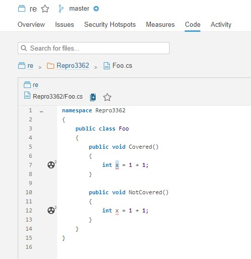

# Reproduction steps for https://github.com/SonarSource/sonar-dotnet/issues/3362

## Steps

- Run the begin step and specify the report path:

`dotnet sonarscanner begin /k:re /d:sonar.cs.vscoveragexml.reportsPaths=filename.coveragexml`

- Build solution

`dotnet build --no-incremental -p:DeterministicSourcePaths=true`

- Run tests with coverage

`dotnet test --no-restore --no-build -c Debug --logger trx --results-directory TestResults --collect:"Code Coverage"`

- Convert coverage to xml format (CodeCoverage.exe can be found in Microsoft.CodeCoverage NuGet package)

`CodeCoverage.exe analyze /output:filename.coveragexml filename.coverage`

- Run the end step

`dotnet sonarscanner end`

## Coverage results:

